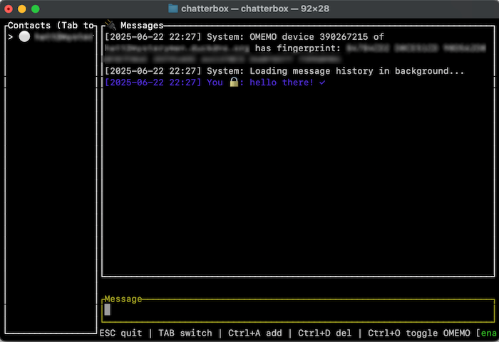

# Chatterbox

This is a secure terminal chat application
implementing XMPP and OMEMO. It is proudly made with Rust.



## Project Stats

- Total lines of Rust code: 18690 lines
- OMEMO implementation: 6274 lines
- XMPP integration: 9004 lines
- UI and app logic: 3412 lines

## Implemented XEPs

This currently implements the following XMPP Extension Protocols:

- XEP-0184: Message Delivery Receipts (delivery status tracking)
- XEP-0313: Message Archive Management (message history)
- XEP-0085: Chat State Notifications (typing indicators)
- XEP-0280: Message Carbons (sync messages across devices)
- OMEMO Encryption 0.3


## Setup Instructions

Run the following command to build the project:

   ```bash
   cargo build && cargo run
   ```

## Architecture and Implementation

See DESIGN.md for the design.

## Contributing

Feel free to submit issues or pull requests if you have suggestions or improvements for the project.
